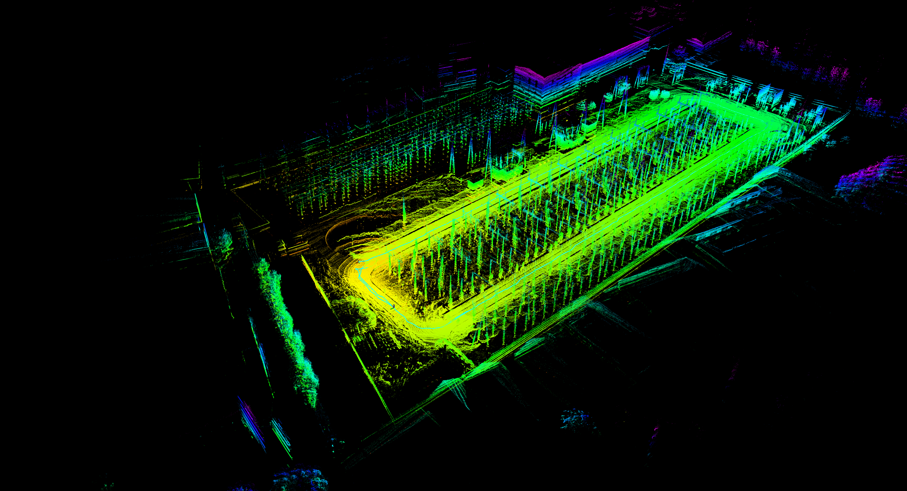
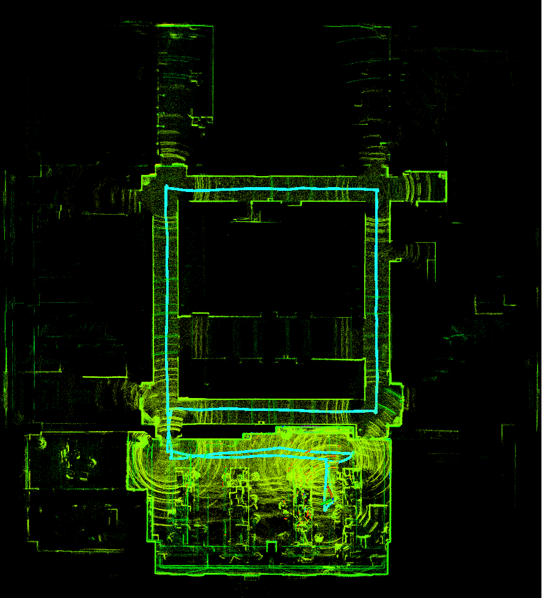
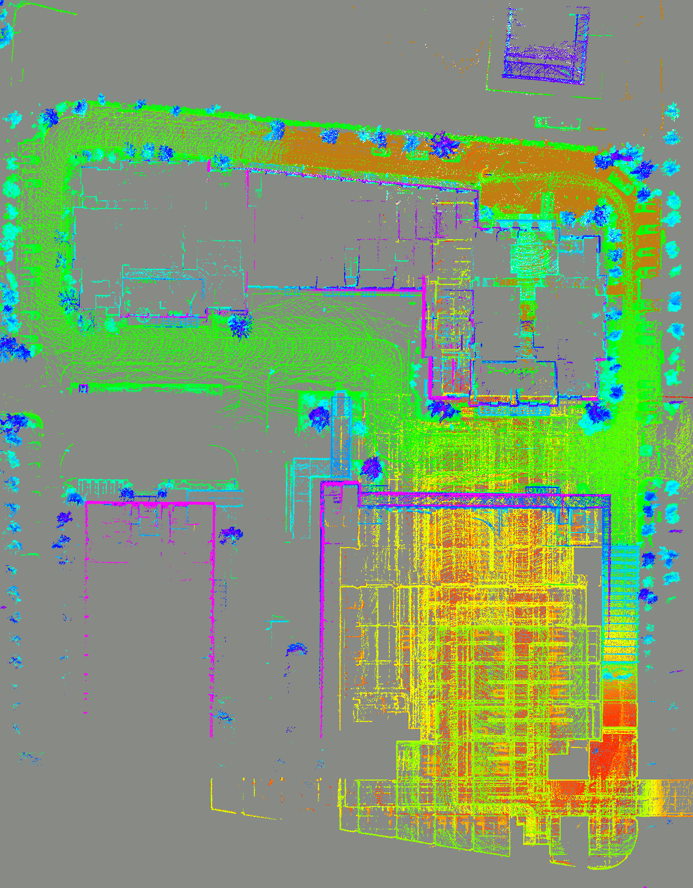
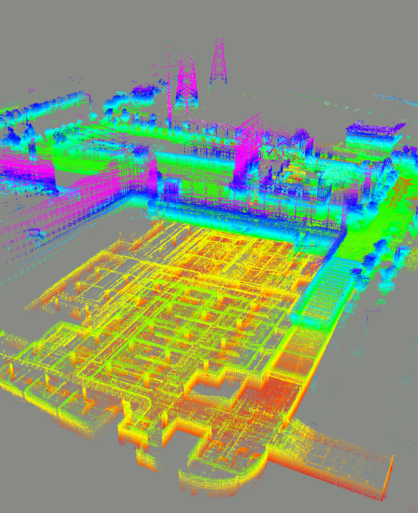
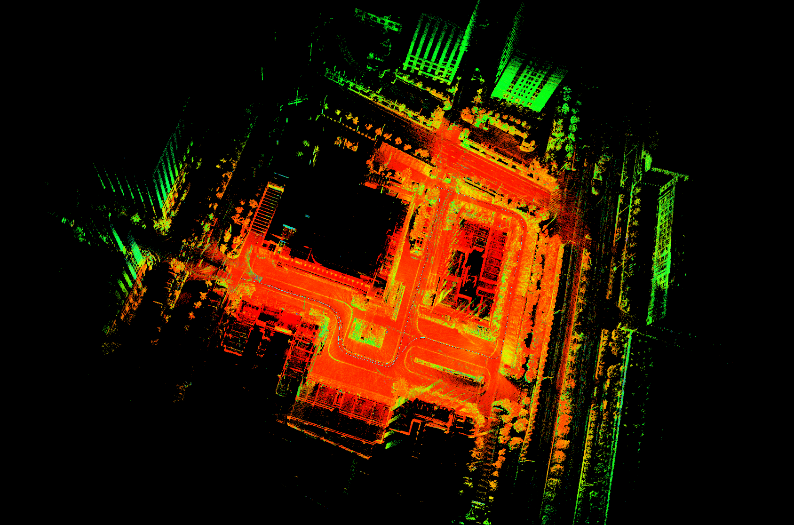

>目前只上传了大部分的图片,视频素材,还在整理描述中,剩余部分,可以先通过网页预览或下载来查看了解一下
------
- [2D](#2d)
  - [退化场景中的定位(长直走廊)](#退化场景中的定位长直走廊)
  - [变化场景中的地图自更新](#变化场景中的地图自更新)
  - [变化场景、遮挡下的防定位丢失](#变化场景遮挡下的防定位丢失)
- [3D](#3d)
  - [3D LIO](#3d-lio)
  - [3D SLAM](#3d-slam)
  - [局部场景下高精鲁棒定位](#局部场景下高精鲁棒定位)

# 2D

## 退化场景中的定位(长直走廊)

- **长廊定位效果展示(长廊环境长度约22米,激光量程10米,图中机器人行驶的走廊长度为22米,定位误差肉眼不可见)**

    

> 如上,平时在退化场景下会出现定位的较大漂移

    

> 加入开发的长廊定位算法后的效果。没有肉眼可见的误差

------

- **基于原始激光点云的长廊环境自识别**

    

## 变化场景中的地图自更新

    

> 大量环境变化下的地图更新

    

> 局部变化下的地图更新(未消失的黑影是由于采图时人员一直在激光后方)

## 变化场景、遮挡下的防定位丢失

- 室内

    

> 蓝色pose箭头变为半透明表示定位丢失

    

> 全程无丢失,回到无变化场景立即恢复高精定位

- 室外

    

    

- 激光被遮挡

  

      
  

# 3D

## 3D LIO

- 地铁检修站

    

> 地铁检修站场景,涉及10度斜坡。
>
> 140m*10m来回两圈,仅前端无回环: **xy误差约2.5cm,z误差约9cm**

- 室外电站

    

- 室内

    

## 3D SLAM

- 从室外建筑群到室内地下停车场(稀疏图)

    

    

    

> 从室外的移动写字楼环绕一圈后 通过 隧道进入地下停车场 再回到室外建图起点
> 基于32线激光/IMU/WheelOdom融合建图,履带式底盘(激光存在高频振动,点云有错帧)

- 建筑群周围(稠密图)

    

## 局部场景下高精鲁棒定位

    

- 多人干扰,新增障碍物下的鲁棒定位

    

